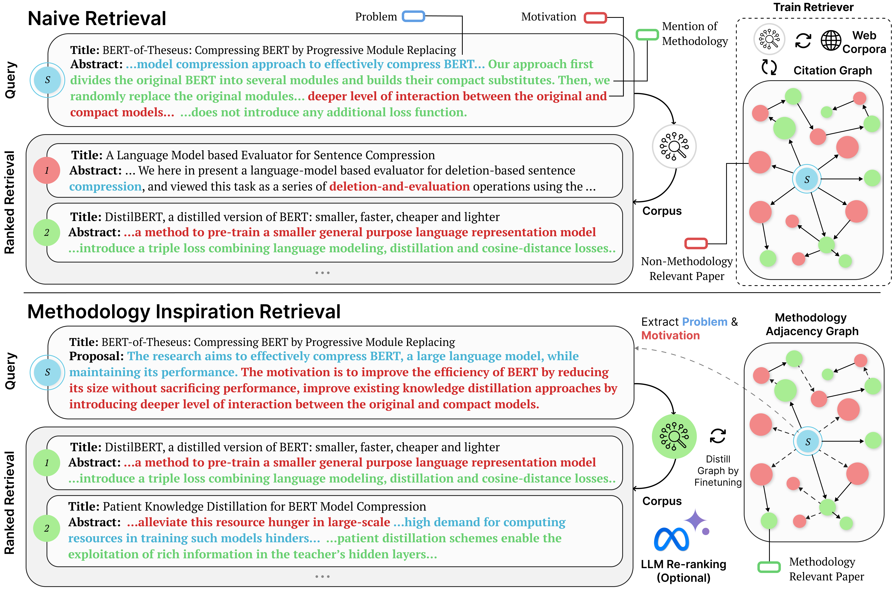

# 🎯 Methodology Inspiration Retrieval

This repository houses the datasets used in our ACL 2025 paper:
**"MIR: Methodology Inspiration Retrieval for Scientific Research Problems"**  🎓



## 🧠 What’s This About?

Our paper explores fundamental questions:

- What’s the best aspect to retrieve papers on when designing novel scientific hypotheses?
- Are current retrievers trained on semantic similarity enough to inspire new solutions?
- What does it take to retrieve true methodological inspirations?

We **extend the MultiCite Dataset** (Lauscher et al. 2022), originally designed for *citation context intent classification*, and **repurpose this for our retrieval benchmark**. Specifically, we consider citations annotated with the intent *uses or extends* as methodologically relevant. We find this provides the most actionable signal towards tracing methodological inspirations in the literature. We further source papers from arXiv, and follow the same procedure in the original paper using their fine-tuned SciBERT model in MultiCite to derive an augmented training dataset, more appropriate for the benchmark.

We use the resulting **MIR-Multicite dataset** to derive the *Methodology Adjacency Graph (MAG)*, which can be understood as a pruned citation graph, where edges are annotated with citation intents pivotal for the task, viz. ‘methodology’ or ‘non-methodology’. Using this structure our paper fine-tunes retrievers by sampling positive, and hard/soft negatives from the MAG using a joint triplet loss.


## 📦 Dataset Overview

The MIR dataset includes:
- 📌 **Research Proposals**: Each proposal consists of a research problem and motivation.
- 📚 **Cited Papers**: Papers cited within the proposals (citing papers), categorized by their methodological citation intent.
- 🧾 **Citation Contexts**: The specific contexts in which the cited papers are referenced.
- 🧭 **Citation Intents**: The intent behind each citation, categorized as methodological or non-methodological.

### 📊 Dataset Splits
The dataset is organized into the following splits:
- **Training Set**: Proposals prior to the year 2019.
- **Development Set**: Proposals from January to June 2019.
- **Test Set**: Proposals after June 2019.
- **Augmented Training Set**: Additional proposals to ensure consistent domain representation.

### 🧪Evaluation Settings

The evaluation settings are divided into two distinct methods to (a) avoid temporal overlap introduced by cited papers of proposals in the same test set, and (b) to avoid overlap with cited papers in the training set. We term these **Restricted Corpus** and **Extended Corpus**. **Restricted Corpus** contains all the cited papers in the test set, while **Extended Corpus** dynamically considers cited papers from both the training set and ground-truth citations associated with each test proposal. This tests retriever performance across a more expansive and diverse corpus

## 📄 Citation

If you intend to use this dataset in your work, please consider citing our paper "MIR: Methodology Inspiration Retrieval for Scientific Research Problems".

```
Coming soon.
```
And the original MultiCite paper.
```
@inproceedings{lauscher-etal-2022-multicite,
    title = "{M}ulti{C}ite: Modeling realistic citations requires moving beyond the single-sentence single-label setting",
    author = "Lauscher, Anne  and
      Ko, Brandon  and
      Kuehl, Bailey  and
      Johnson, Sophie  and
      Cohan, Arman  and
      Jurgens, David  and
      Lo, Kyle",
    editor = "Carpuat, Marine  and
      de Marneffe, Marie-Catherine  and
      Meza Ruiz, Ivan Vladimir",
    booktitle = "Proceedings of the 2022 Conference of the North American Chapter of the Association for Computational Linguistics: Human Language Technologies",
    month = jul,
    year = "2022",
    address = "Seattle, United States",
    publisher = "Association for Computational Linguistics",
    url = "https://aclanthology.org/2022.naacl-main.137/",
    doi = "10.18653/v1/2022.naacl-main.137",
    pages = "1875--1889"
}
```

## 📬 Contact

For any questions or further information, please get in touch with aniketh.g@tcs.com

